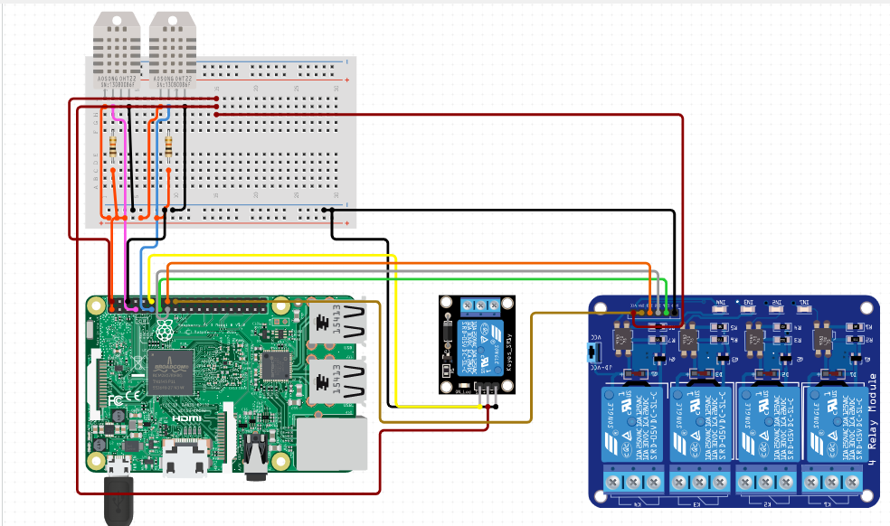

# ChickenPenController

The Chicken Pen Controller is a Small Python project integrated with HomeAssistant designed to monitor and control temperature and humidity levels in a chicken pen. It utilizes sensors, such as the DHT22, and interacts with various components, including fans, heaters, and Raspberry Pi GPIO pins, to maintain optimal conditions for the chickens.

## Features

Monitors temperature and humidity levels inside and outside the chicken pen
Controls fans, heaters, and Raspberry Pi fan based on predefined temperature and humidity thresholds
Publishes sensor data and control status using MQTT protocol (optional)
Provides logging functionality to track system behavior and errors

## Hardware Requirements

Raspberry Pi
DHT22 temperature and humidity sensor
Fans, heaters, and other components connected to Raspberry Pi GPIO pins as per the configuration

## Software Requirements

Python 3.x
Required Python libraries: Adafruit_DHT, paho-mqtt, RPi.GPIO, gpiozero

## Schematics



## Logging

The system logs debug and error messages to the ChickenPenController.log file. Use this file to track the system behavior and diagnose any issues.

## Configuration

The script need a configuration file "ChickenPenController.config" that contains various settings for the system. Modify these settings according to your requirements. The configuration options include:

``` config
[Sensor]
refreshRate=2 how many times the script check the sensors
dhtPinExternal=4 control pin for the external humidity/temperature sensor, BCM mode
dhtPinInternal=5 control pin for the internal humidity/temperature sensor, BCM mode
fanPin=6 control pin for the fan of the chicken pen, BCM mode
heatherPin=7,8 control pins for for the heather and heather fan of the chicken pen, BCM mode
radioPin=9 control pin for the radio, BCM mode
rpiFanPin=10 control pin for the raspberry fan, BCM mode
externalTempOffset=0 temperature offset to add precision on the temperature reading
internalTempOffset=0 temperature offset to add precision on the temperature reading

[MQTT]
mqttActive=True to start the communication with the HomeAssistant server
host=ip of the server
user=user to login
password=password to login
topic=homeAssistant topic subscription
externalTemperatureChannel=externalTemperatureChannel
externalHumidityChannel=externalHumidityChannel
internalTemperatureChannel=internalTemperatureChannel
internalHumidityChannel=internalHumidityChannel
fanStatusChannel=fanStatusChannel
heatherStatusChannel=heatherStatusChannel
radioChannel=radioChannel
```
